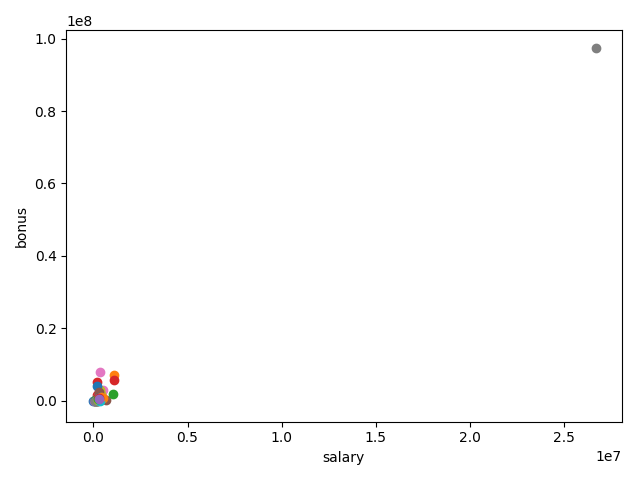
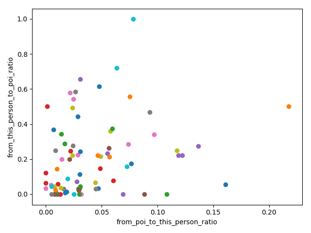
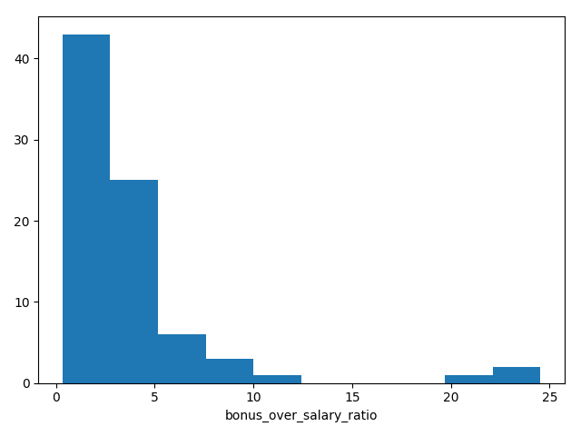

# Identify Fraud from Enron Email

## Data Exploration

The goal for this project is to use data from the Enron dataset which contains financial and email information from 
people involved in the Enron scandal to build build a predictive model which could identify POIs (persons of interest).

### Data Structure

The master db contains information of each person with the following structure:

* Financial data:
    * `bonus` 
    * `deferral_payments` 
    * `deferred_income` 
    * `director_fees` 
    * `email_address` 
    * `exercised_stock_options` 
    * `expenses`
    * `loan_advances` 
    * `long_term_incentive` 
    * `other` 
    * `restricted_stock` 
    * `restricted_stock_deferred` 
    * `salary` 
    * `total_payments` 
    * `total_stock_value`
* Email data: 
    * `from_messages`
    * `to_messages` 
    * `from_poi_to_this_person` 
    * `from_this_person_to_poi`
    * `shared_receipt_with_poi` 
* POI
    * `poi`  
    
Here are a few examples extracted from our output (`console-exec.log`):

```json
{
  "METTS MARK": {
    "bonus": 600000,
    "deferral_payments": "NaN",
    "deferred_income": "NaN",
    "director_fees": "NaN",
    "email_address": "mark.metts@enron.com",
    "exercised_stock_options": "NaN",
    "expenses": 94299,
    "from_messages": 29,
    "from_poi_to_this_person": 38,
    "from_this_person_to_poi": 1,
    "loan_advances": "NaN",
    "long_term_incentive": "NaN",
    "other": 1740,
    "poi": false,
    "restricted_stock": 585062,
    "restricted_stock_deferred": "NaN",
    "salary": 365788,
    "shared_receipt_with_poi": 702,
    "to_messages": 807,
    "total_payments": 1061827,
    "total_stock_value": 585062
  }, "GLISAN JR BEN F": {
    "bonus": 600000,
    "deferral_payments": "NaN",
    "deferred_income": "NaN",
    "director_fees": "NaN",
    "email_address": "ben.glisan@enron.com",
    "exercised_stock_options": 384728,
    "expenses": 125978,
    "from_messages": 16,
    "from_poi_to_this_person": 52,
    "from_this_person_to_poi": 6,
    "loan_advances": "NaN",
    "long_term_incentive": 71023,
    "other": 200308,
    "poi": true,
    "restricted_stock": 393818,
    "restricted_stock_deferred": "NaN",
    "salary": 274975,
    "shared_receipt_with_poi": 874,
    "to_messages": 873,
    "total_payments": 1272284,
    "total_stock_value": 778546
  }
}
```

There is a total of 146 "persons" (or datapoints) on the data set, our of which 18 are POIs.

The POIs are identified as followed: `HANNON KEVIN P, COLWELL WESLEY, RIEKER PAULA H, KOPPER MICHAEL J, SHELBY REX, DELAINEY DAVID W, LAY KENNETH L, BOWEN JR RAYMOND M, BELDEN TIMOTHY N, FASTOW ANDREW S, CALGER CHRISTOPHER F, RICE KENNETH D, SKILLING JEFFREY K, YEAGER F SCOTT, HIRKO JOSEPH, KOENIG MARK E, CAUSEY RICHARD A, GLISAN JR BEN F`

*The data exploration features are described by code on the file `src/helpers/analyse.py`*

## Outliers

The outliers detection covers 4 steps:

1. Identify cases with lots of missing data
    
    This condition was based on a few fields being NaN or 0, and accounted for the following fields:
     * salary
     * bonus
     * total_payments
     * from_poi_to_this_person
     * from_this_person_to_poi
     * total_stock_value
     * from_messages
     * to_messages
    
    When a "person" meets all of this fields under the criteria, it is considered a potential outlier.
    
2. Identified salaries out of the normal

    This validation is performed by validating the `salary` and `bonus` fields for values out of the normal. 
    For that we used the following plot:
    
    
    
    At simple sight we can see at least one value being out of proportions with the rest, so we filter them out, the 
    condition was as follow:
    
    `data[person]['salary'] > 800000 or data[person]['bonus'] > 6000000`

3. Investigate the "persons" (keys) properly 

    This is the result of manually looking at the cases, person by person and noticing that 1 of the "person" records 
    is actually a company name: `THE TRAVEL AGENCY IN THE PARK`

4. Re-validate potential outliers

    Just to make sure we are not marking anyone critical as outlier we drop from the outlier list those who meet the 
    following criteria:
    
    1. Are POIs
    2. Have high interactions with a POI 

*The outlier detection and extraction features are described by code on the file `src/helpers/outliers.py`*

## Feature selection 
show the 
Initially we started off the analysis with all the features but this happened to carry a lot of unimportant or 
irrelevant fields for processing I applied an algorithm to detect relevant fields and a separate logic to add new 
features.

### Find optimal features
In order to reduce the noise created by irrelevant features I used a `SelectKBest` algorithm to sort the features and 
keep only those relevant once

### Adding new features
New features were created by processing rations of the information we had, here are the new fields:

1. `from_poi_to_this_person_ratio`: messages from POIs / total messages received
2. `from_this_person_to_poi_ratio`: messages to POIs / total messages sent
3. `bonus_over_salary_ratio`: simply bonus / salary

The following charts detail this ratios:

Chatter plot highlighting the messages ratios


Histogram covering the bonus over salary ratio


### Result

The final contains the following features:

 * `poi`
 * `salary`
 * `total_payments`
 * `loan_advances`
 * `bonus`
 * `total_stock_value`
 * `expenses`
 * `exercised_stock_options`
 * `other`
 * `long_term_incentive`
 * `shared_receipt_with_poi`

*The feature selection is described by code on the file `src/helpers/features.py`*

## Classifiers

In this section we will explore the different classifiers we tried and finally we are going to pick the one which gave 
us the optimal results.

### Results per classifier using the optimal features

1. Gaussian Naive Bayes
    ```
    accuracy: 0.723255813953
    precision: 0.362344248041
    recall:    0.350944444444
    ```
2. Ada Boost
    ```
    accuracy: 0.829302325581
    precision: 0.33321978022
    recall:    0.300992063492
    ```
3. Random Forest
    ```
    accuracy: 0.864186046512
    precision: 0.371666666667
    recall:    0.139746031746
    ```
4. SVC
    ```
    accuracy: 0.531627906977
    precision: 0.19103343927
    recall:    0.501496031746
    ```
   
Since the best results where achieved using Ada Boost, that's the one we selected for the final output.

 *The feature selection is described by code on the file `src/helpers/analyse.py`*